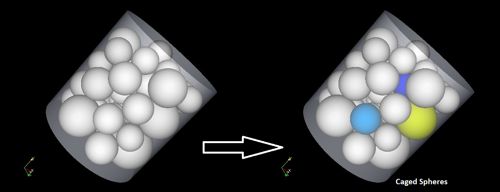
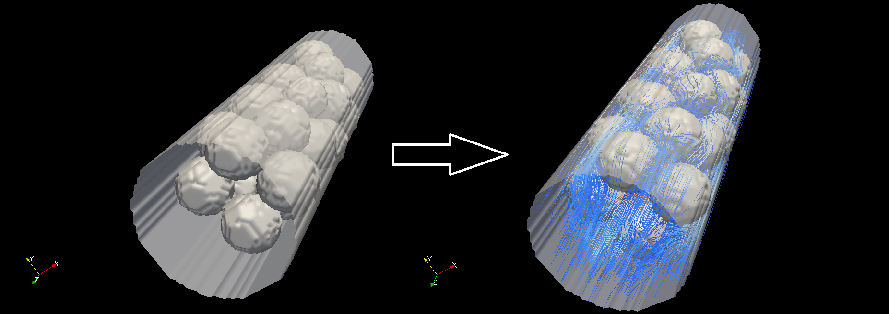

# Random Sphere Packing Simulation

This program simulates a random sphere packing in a cylinder using the Monte Carlo method. The spheres can have two ranges of sizes (with random distributions around the mean) and are randomly packed in the cylinder. The program utilizes GNU's GLPK library to identify the caged spheres, which are a subset of spheres that are confined between other ones and can move within their cage.


The packing simulation algorithm was developed as part of my MSc thesis at [Isfahan University of Technology](http://english.iut.ac.ir/Department-of-Mechanical-Engineering). The jammed particle identification algorithm has been implemented using the method proposed by [Donev, A., Torquato, S., Stillinger, F.H. and Connelly, R. (2004) JCP 197(1)](https://doi.org/10.1016/j.jcp.2003.11.022).

The results from this program were intended for use in a flow solver to simulate fluid flows through packed beds. The flow solvers for the simulation of gaseous mixtures through these packed beds remain unpublished (for the time being), but can be obtained via contacting with me. 
"Lattice Boltzmann simulation of creeping flow through a packed bed, flow visualization using [paraview](https://www.paraview.org/), image obtained from Rastegari, S.A., 2009. Simulation of Gaseous Mixture Flows in a packed bed of unfixed particles, MSc thesis, Isfahan University of Technology"

## Program Input

The program expects the input to be provided in the file `info.packing`. This file contains various lines that specify the parameters and settings for the random sphere packing simulation. Each line in the file is accompanied by an explanation to help understand its purpose and usage.

## Program Outputs
The program outputs the locations of the sphere centers, their diameters, and marks the caged spheres. 

## Citation

If you use the results obtained from this program in your research or work, please cite the following reference:

Rastegari, S.A., 2009. Simulation of Gaseous Mixture Flows in a packed bed of unfixed particles, MSc thesis, Isfahan University of Technology.

## Dependencies

The program relies on the GNU GLPK library for identifying caged spheres. Ensure that you have the GLPK library installed on your system before running the program.

## Usage

To compile and run the program, follow the steps below:

1. Make sure you have the GLPK library installed on your system.
2. Set the path to GLPK directory (GLPK_DIR) at the beginning of the Makefile 
3. Compile the program using the provided Makefile. Run the following command:

```
make
```

4. Once the compilation is successful, execute the program with the following command:

```
./packing
```


The program will perform the random sphere packing simulation according to the parameters specified in the `info.packing` file. The results will be displayed on the console and saved to an output file.

## Verification
The program has gone through some verification studies an example of which is found in the "verification" directory of this repo. 

## Author

This program was developed by Amirreza Rastegari. For questions or inquiries, please contact him at [arstgri@gmail.com](mailto:arstgri@gmail.com).

## License

This program is licensed under the MIT License. Refer to the [LICENSE](LICENSE) file for more information.

